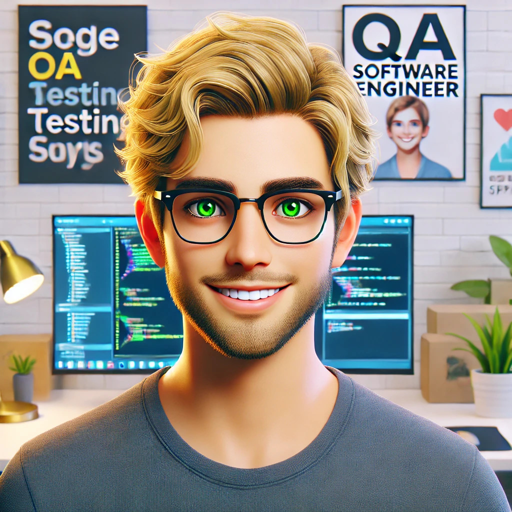

# 🌌 Bem-vindo ao meu GitHub!

## Olá, eu sou Thiago michel ariça!

🌌 _"Em uma galáxia muito, muito distante..."_

Thiago Michel Ariça PCD Profissional de tecnologia com foco em qualidade de software com base técnica em desenvolvimento e automação de testes, graduado em análise e desenvolvimento de sistemas e cursando MBA em gestão de qualidade e processos.

Possui Experiência em ferramentas como Robot Framework, Cypress, e Playwright, além de amplo conhecimento em linguagens e frameworks de desenvolvimento, como Java, Spring Boot, HTML, CSS, e JavaScript. Possui experiência prática no ciclo completo de desenvolvimento e qualidade, incluindo criação e consumo de APIs RESTful, automação de processos repetitivos, e validação de aplicações robustas e escaláveis. Com vivência em bancos de dados relacionais, utiliza técnicas avançadas para garantir a integridade e eficiência dos sistemas testados.

No âmbito corporativo, atuou em empresas renomadas como Mercado Livre e Thomson Reuters, contribuindo para o desenvolvimento de soluções inovadoras, escaláveis e seguras. Atualmente, dedico-me à implementação de estratégias de automação de testes, com foco em garantir qualidade, eficiência e confiabilidade em entregas de software.

Diferenciais incluem capacidade analítica, visão estratégica e habilidades interpessoais que permitem a condução de projetos com alto impacto organizacional.

- 💻 Desenvolvedor Full Stack em Java
- 🚀 Amante de Star Wars
- 🌟 Sempre aprendendo novas tecnologias

## Tecnologias que eu uso:

### Frontend

  
  

### Backend

  
  
  
  

### Automação

  
  
  

### Database

### Vamos nos conectar!

## Que a Força esteja com você!

